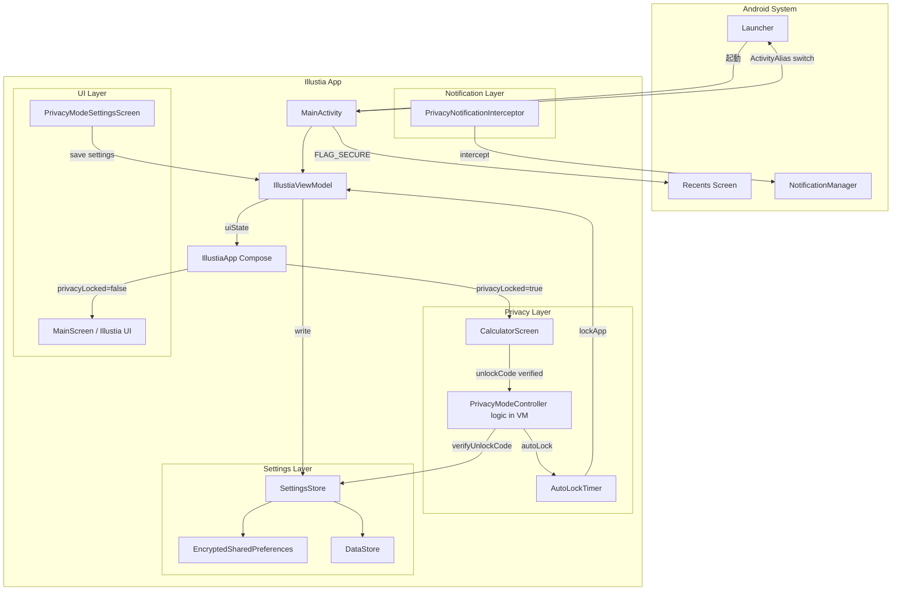
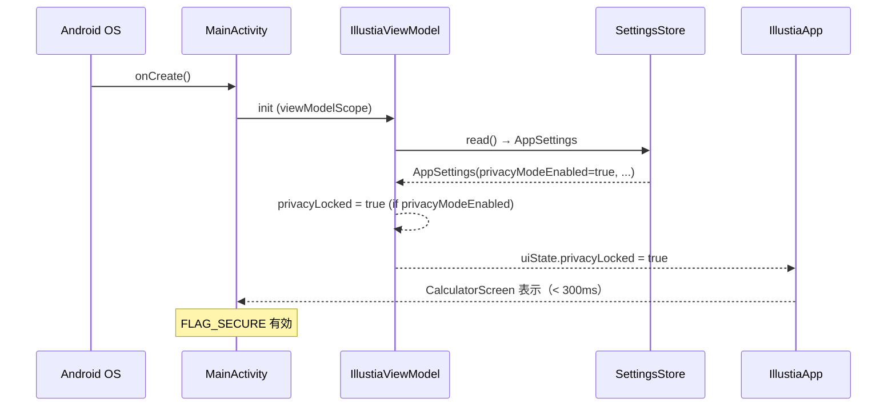
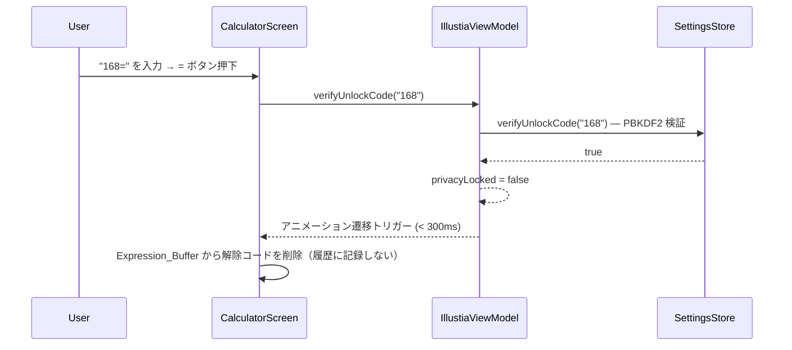

# Design Document — Privacy Mode

## Overview

Privacy Mode は Illustia に対して「電卓アプリ」としてカモフラージュするレイヤーを追加する機能である。
プライバシーモードが有効な場合、アプリ起動時には電卓 UI が全画面で表示され、特定の解除コードを入力したときのみ Illustia 本体へ遷移する。
アプリ切り替え画面（Recents）への Pixiv コンテンツ露出、スクリーンショット、通知内容、ランチャーアイコン・アプリ名も隠蔽する。

本機能は既存の `AppSettings`・`SettingsStore`・`IllustiaViewModel`・`MainActivity` の構造を最大限活用し、
最小限の変更で安全かつ保守しやすい形で実装する。

---

## Architecture

### 高レベルコンポーネント図



### データフロー（起動シーケンス）



### データフロー（解除シーケンス - パターンB）



---

## Components and Interfaces

### 1. `AppSettings` — 拡張フィールド

既存の `data class AppSettings` に以下フィールドを追加する。

```kotlin
// privacy-mode 追加フィールド
val privacyModeEnabled: Boolean = false,
val privacyModeAutoLockTiming: String = "immediate",  // immediate|30s|1m|5m|10m|disabled
val hideRecents: Boolean = true,
val hideNotifications: Boolean = false,
val dummyAppName: String = "電卓",
val dummyIconVariant: String = "ic_launcher_dummy",
```

### 2. `SettingsStore` — 解除コード管理メソッド

既存の `savePinHash()` / `verifyPin()` パターンを踏襲した unlock code 専用メソッドを追加する。
キーは別のプレフィックスを使い、AppLock の PIN と混在しない。

```kotlin
// --- Unlock Code (Privacy Mode) ---

/**
 * 解除コードを PBKDF2WithHmacSHA256 + 32byte ソルト + 100,000 iterations でハッシュ化し
 * EncryptedSharedPreferences に保存する。
 */
fun saveUnlockCodeHash(code: String)

/**
 * 指定した解除コードが保存済みハッシュと一致するか定数時間で検証する。
 * @return 一致すれば true
 */
fun verifyUnlockCode(code: String): Boolean

/**
 * 解除コードが設定済みかどうかを返す。
 */
fun hasUnlockCodeSet(): Boolean

/**
 * 解除コードハッシュを削除する（プライバシーモード無効化時に呼ぶ）。
 */
fun clearUnlockCodeHash()

/**
 * 解除コードのバリデーション。4〜20 文字で数字・演算子記号のみ許容。
 * @return 有効なら true
 */
fun isValidUnlockCode(code: String): Boolean

// --- DataStore keys (追加) ---
// PRIVACY_MODE_ENABLED, PRIVACY_MODE_AUTO_LOCK_TIMING, HIDE_RECENTS,
// HIDE_NOTIFICATIONS, DUMMY_APP_NAME, DUMMY_ICON_VARIANT
```

### 3. `IllustiaUiState` — 拡張フィールド

```kotlin
// privacy-mode 追加フィールド
val privacyLocked: Boolean = false,       // プライバシーモードのロック状態
val calculatorBuffer: String = "",         // Expression_Buffer
val calculatorHistory: List<CalculatorHistoryEntry> = emptyList(), // 最大 20 件
val isTransitioningToIllustia: Boolean = false, // 遷移アニメーション中フラグ
```

### 4. `IllustiaViewModel` — プライバシーモード関連メソッド

```kotlin
// --- Privacy Mode 制御 ---

/** プライバシーモードを有効化する。未設定なら初期コード "168" を保存。 */
fun enablePrivacyMode()

/** プライバシーモードを無効化し、ロック状態をリセットする。 */
fun disablePrivacyMode()

/** 解除コードを検証し、成功なら privacyLocked=false にして遷移アニメーションを開始。 */
fun verifyAndUnlockPrivacy(code: String): Boolean

/** 遷移アニメーション完了を通知する（CalculatorScreen から呼ぶ）。 */
fun confirmPrivacyUnlock()

/** 電卓の入力文字をバッファへ追加する（上限 50 文字）。 */
fun appendToCalculatorBuffer(char: Char)

/** バッファをクリアし "0" 表示状態にする。 */
fun clearCalculatorBuffer()

/** バッファの末尾 1 文字を削除する。 */
fun deleteLastCalculatorBuffer()

/** = ボタン押下時の処理（解除コード確認 → 計算 → 履歴追加）。 */
fun evaluateCalculatorExpression()

/** 解除コードを変更する（現コード照合に成功した場合のみ）。 */
fun changeUnlockCode(currentCode: String, newCode: String): Boolean

/** 現在の解除コードを検証する（設定画面での確認用）。 */
fun verifyCurrentUnlockCode(code: String): Boolean

/** Auto-lock タイマーを開始する（バックグラウンド移行時）。 */
fun startAutoLockTimer()

/** Auto-lock タイマーをキャンセルする（フォアグラウンド復帰時）。 */
fun cancelAutoLockTimer()

/** 即時ロックを実行する（画面 OFF・端末ロック時）。 */
fun lockPrivacyMode()

/** ダミーアイコン・アプリ名を切り替える。 */
fun applyDummyAppIcon(context: Context, enabled: Boolean)

// --- 設定値更新 ---
fun updatePrivacyModeAutoLockTiming(value: String)
fun updateHideRecents(value: Boolean)
fun updateHideNotifications(value: Boolean)
fun updateDummyAppName(value: String)
fun updateDummyIconVariant(value: String)
```

### 5. `CalculatorScreen` — Composable

```kotlin
@Composable
fun CalculatorScreen(
    buffer: String,                         // Expression_Buffer
    history: List<CalculatorHistoryEntry>,  // 最大 20 件
    isTransitioning: Boolean,               // 遷移アニメーション中
    viewModel: IllustiaViewModel,
)
```

内部の `CalculatorEngine` は純粋関数として切り出し、PBT が容易な設計にする。

```kotlin
object CalculatorEngine {
    /** 数式文字列を評価し、結果を Double または null（エラー）で返す。 */
    fun evaluate(expression: String): Double?

    /** 結果をユーザー表示用文字列にフォーマットする。 */
    fun formatResult(value: Double): String
}
```

### 6. `CalculatorHistoryEntry` — データクラス

```kotlin
data class CalculatorHistoryEntry(
    val expression: String,
    val result: String,
)
```

### 7. `PrivacyModeSettingsScreen` — Composable

```kotlin
@Composable
fun PrivacyModeSettingsScreen(
    state: IllustiaUiState,
    viewModel: IllustiaViewModel,
    onBack: () -> Unit,
)
```

`SettingsScreen.kt` からナビゲーションで遷移する。新ルート `AppRoute.PrivacyModeSettings` を追加する。

### 8. `AutoLockTimer` — ViewModel 内の内部実装

`Job` を使ったコルーチンタイマー。`viewModelScope` 内で管理する。

```kotlin
private var autoLockJob: Job? = null

private fun scheduleAutoLock(delayMs: Long) {
    autoLockJob?.cancel()
    autoLockJob = viewModelScope.launch {
        delay(delayMs)
        lockPrivacyMode()
    }
}
```

### 9. `PrivacyNotificationInterceptor` — 通知チャンネル・ビルダーへの介入

`NotificationCompat.Builder` を wrap する形で提供。既存通知発行箇所に差し込む。

```kotlin
object PrivacyNotificationInterceptor {
    /**
     * hideNotifications=true なら title/body/images を汎用テキストに置換した
     * Builder を返す。false ならそのまま返す。
     */
    fun intercept(
        builder: NotificationCompat.Builder,
        hideNotifications: Boolean,
    ): NotificationCompat.Builder
}
```

### 10. `DummyAppIconSwitcher` — ActivityAlias 切り替えユーティリティ

```kotlin
object DummyAppIconSwitcher {
    const val ALIAS_REAL    = "com.yunfie.illustia.MainActivity"
    const val ALIAS_DUMMY   = "com.yunfie.illustia.MainActivityDummy"

    /**
     * privacyModeEnabled に応じて PackageManager.setComponentEnabledSetting() を呼ぶ。
     * メインスレッド外で呼ぶこと。
     */
    fun apply(context: Context, privacyModeEnabled: Boolean)
}
```

AndroidManifest.xml に `<activity-alias>` を追加する必要がある。

---

## Data Models

### `AppSettings` — 追加フィールド（再掲・型付き）

| フィールド | 型 | デフォルト | 保存先 |
|---|---|---|---|
| `privacyModeEnabled` | `Boolean` | `false` | DataStore |
| `privacyModeAutoLockTiming` | `String` | `"immediate"` | DataStore |
| `hideRecents` | `Boolean` | `true` | DataStore |
| `hideNotifications` | `Boolean` | `false` | DataStore |
| `dummyAppName` | `String` | `"電卓"` | DataStore |
| `dummyIconVariant` | `String` | `"ic_launcher_dummy"` | DataStore |

### `SettingsStore` — 追加キー

| キー定数 | 型 | EncryptedSharedPreferences |
|---|---|---|
| `KEY_UNLOCK_CODE_HASH` | `String` | ✅ |
| `KEY_UNLOCK_CODE_SALT` | `String` | ✅ |

### `IllustiaUiState` — 追加フィールド（再掲）

| フィールド | 型 | 初期値 |
|---|---|---|
| `privacyLocked` | `Boolean` | `false` |
| `calculatorBuffer` | `String` | `""` |
| `calculatorHistory` | `List<CalculatorHistoryEntry>` | `emptyList()` |
| `isTransitioningToIllustia` | `Boolean` | `false` |

### AutoLockTiming の文字列定義

| 値 | 動作 |
|---|---|
| `"immediate"` | バックグラウンド移行直後 |
| `"30s"` | 30 秒後 |
| `"1m"` | 1 分後 |
| `"5m"` | 5 分後 |
| `"10m"` | 10 分後 |
| `"disabled"` | タイムアウトなし |

---

## Correctness Properties

*A property is a characteristic or behavior that should hold true across all valid executions of a system — essentially, a formal statement about what the system should do. Properties serve as the bridge between human-readable specifications and machine-verifiable correctness guarantees.*

PBT には [Kotest Property Testing](https://kotest.io/docs/proptest/property-based-testing-container.html) を使用する（Kotlin/JVM 向けの成熟した PBT ライブラリ）。各テストは最低 100 回のイテレーションを実行する。

---

### Property 1: 解除コードのラウンドトリップ保存

*For any* 有効な解除コード文字列 `c`（4〜20 文字、数字・演算子記号のみ）に対して、
`SettingsStore.saveUnlockCodeHash(c)` を呼び出した後に `SettingsStore.verifyUnlockCode(c)` を呼ぶと `true` を返す。

**Validates: Requirements 12.5**

---

### Property 2: 解除コードの非衝突性

*For any* 2 つの異なる有効な解除コード文字列 `c1 ≠ c2` に対して、
`SettingsStore.saveUnlockCodeHash(c1)` を呼び出した後に `SettingsStore.verifyUnlockCode(c2)` を呼ぶと `false` を返す。

**Validates: Requirements 12.6**

---

### Property 3: Expression_Buffer の上限不変条件

*For any* 初期バッファ状態と任意の入力文字列（数字・演算子・小数点の組み合わせ）に対して、
バッファへの追加操作後も `calculatorBuffer.length <= 50` が常に成立する。

**Validates: Requirements 3.1**

---

### Property 4: バッファ削除操作の長さ不変条件

*For any* 非空の `calculatorBuffer` 文字列 `b`（長さ `n > 0`）に対して、
`deleteLastCalculatorBuffer()` を呼ぶと、バッファは長さ `n - 1` になり、先頭 `n - 1` 文字が `b` の先頭と一致する。

**Validates: Requirements 3.4**

---

### Property 5: クリア操作の完全性

*For any* `calculatorBuffer` 状態（空でも非空でも）に対して、
`clearCalculatorBuffer()` を呼ぶと、バッファは空文字列になる。

**Validates: Requirements 3.3**

---

### Property 6: 解除コードの長さバリデーション

*For any* 文字列 `s` に対して、
`SettingsStore.isValidUnlockCode(s)` は `s.length in 4..20` かつ許可文字のみで構成される場合のみ `true` を返し、
それ以外では常に `false` を返す。

**Validates: Requirements 5.6**

---

### Property 7: コード変更の前提条件

*For any* 現解除コード `current` と新解除コード `new`（ともに有効な形式）に対して、
`changeUnlockCode(current, new)` は正しい `current` を提示した場合のみ成功（`true`）し、
成功後は `verifyUnlockCode(new) == true` かつ `verifyUnlockCode(current) == false` が成立する。

**Validates: Requirements 5.4**

---

### Property 8: 解除コード照合成功時の履歴非記録

*For any* 有効な解除コード `code` に対して、
`code=` の形式で入力して `evaluateCalculatorExpression()` が解除成功した後も、
`calculatorHistory` のいずれのエントリも `code` を含む文字列を保持しない。

**Validates: Requirements 4.3**

---

### Property 9: 無効式の評価はエラー状態を返す

*For any* 数学的に無効な（ゼロ除算・構文エラーを含む）式文字列 `expr` に対して、
`CalculatorEngine.evaluate(expr)` は `null` を返す。

**Validates: Requirements 3.5**

---

### Property 10: 有効式の評価は Double を返す

*For any* 有効な（構文的・数学的に正当な）数式文字列 `expr` に対して、
`CalculatorEngine.evaluate(expr)` は `null` でない値（`Double`）を返す。

**Validates: Requirements 3.2**

---

### Property 11: 通知隠蔽の普遍性

*For any* `NotificationCompat.Builder` インスタンスに対して、
`hideNotifications = true` を指定して `PrivacyNotificationInterceptor.intercept()` を呼ぶと、
返された Builder のタイトル・本文・大アイコン・BigPicture コンテンツが元の値と異なる汎用値に置き換えられている。

**Validates: Requirements 9.1, 9.2**

---

### Property 12: 設定ラウンドトリップ（プライバシーモード設定）

*For any* 有効な `AppSettings` インスタンス（プライバシーモード関連フィールドを含む）に対して、
`SettingsStore.write(settings)` → `SettingsStore.read()` のラウンドトリップ後も、
プライバシーモード関連フィールドが元の値と一致する。

**Validates: Requirements 1.1**

---

## Error Handling

### 電卓の評価エラー

- ゼロ除算・構文エラー（不完全な式、演算子の連続等）は `CalculatorEngine.evaluate()` が `null` を返す。
- UI は「エラー」と表示し、次の入力（数字・演算子・`C`）で自動クリアする。
- 例外を UI 層まで伝播させない。`CalculatorEngine` 内で `try-catch` し `null` を返す。

### 解除コード照合エラー

- 不一致時は `Calculator_Screen` に特別なフィードバックを一切表示しない（偽陰性時と区別不可にする）。
- 通常の式として処理する（数式として不正であれば「エラー」表示になる）。

### PBKDF2 ハッシュ計算エラー

- `SecretKeyFactory.getInstance()` などの例外は `SettingsStore` 内でキャッチしログに記録する。
- 暗号エラーが発生した場合、`verifyUnlockCode()` は `false` を返す（フェイルセーフ）。

### ActivityAlias 切り替えエラー

- `PackageManager.setComponentEnabledSetting()` は非同期で反映されるため、即時の状態変化を保証しない。
- エラー（`SecurityException` 等）は `DummyAppIconSwitcher` 内でキャッチし、ログに記録するが UI エラーは表示しない。

### AutoLock タイマー

- `viewModelScope` がキャンセルされた場合（アプリプロセス終了）、タイマーは自動的にキャンセルされる。
- 次回起動時に `privacyModeEnabled == true` であれば必ず `privacyLocked = true` で開始する。

### 通知隠蔽

- `PrivacyNotificationInterceptor` は既存の通知発行パスに挿入するが、例外が発生した場合は元の `Builder` をそのまま返す（フェイルオープン）。

---

## Testing Strategy

### ユニットテスト（JUnit + Kotest）

対象：`CalculatorEngine`、`SettingsStore`（解除コード関連）、`PrivacyNotificationInterceptor`、`DummyAppIconSwitcher`

- `CalculatorEngine.evaluate()` の具体例テスト（`1+1=2`、`10/2=5`、`0/0=null` 等）
- `SettingsStore` の `isValidUnlockCode()` 境界値テスト（長さ 3・4・20・21 文字）
- `changeUnlockCode()` の成功・失敗ケース
- 通知隠蔽の before/after 比較（タイトル・本文・画像が置換されること）

### プロパティベーステスト（Kotest Property Testing、各 100 回以上）

各テストには以下の形式でタグを付与する：
**Feature: privacy-mode, Property {番号}: {プロパティテキスト}**

1. **Property 1**: 解除コードのラウンドトリップ — 任意の有効コードで保存→検証が `true`
2. **Property 2**: 非衝突性 — 任意の 2 つの異なるコードで照合が `false`
3. **Property 3**: バッファ上限 — 任意の入力列でも 50 文字を超えない
4. **Property 4**: 削除操作の長さ変化 — 任意の非空バッファで 1 文字減少
5. **Property 5**: クリア完全性 — 任意の状態でクリア後は空文字列
6. **Property 6**: 長さバリデーション — 4〜20 文字の有効/無効判定が正確
7. **Property 7**: コード変更の前提条件 — 正しいコードのみ変更が成功
8. **Property 8**: 解除時の履歴非記録 — 解除コードが履歴に入らない
9. **Property 9**: 無効式 → null — 任意の無効式で null が返る
10. **Property 10**: 有効式 → Double — 任意の有効式で値が返る
11. **Property 11**: 通知隠蔽の普遍性 — 任意の Builder でコンテンツが置換される
12. **Property 12**: 設定ラウンドトリップ — 任意の設定で保存→読み込みが一致

### UI / インテグレーションテスト（Espresso / Compose UI Test）

- プライバシーモード有効状態での起動時に `CalculatorScreen` が 300ms 以内に表示されること（EXAMPLE）
- パターンB: 正しいコード入力 → Illustia 遷移のアニメーションが実行されること
- パターンC: 履歴ヘッダー長押し → ダイアログ表示 → 正しいコード → 遷移
- Recents サムネイル差し替えの動作確認（手動テスト推奨）
- ダミーアイコン切り替え後のランチャーアイコン変更確認（手動テスト推奨）

### セキュリティ観点のテスト

- 平文保存の不在: `saveUnlockCodeHash(code)` 後に EncryptedSharedPreferences の値が `code` の平文を含まないこと（EXAMPLE）
- 解除失敗時にフィードバックがないこと: 誤コード入力後、UI 状態が通常の計算エラーと同一であること（EXAMPLE）

### テスト対象外（手動確認推奨）

- `FLAG_SECURE` の実際の効果（スクリーンショット・Recents のサムネイル）
- ActivityAlias 切り替え後のランチャーへの反映タイミング
- 端末ロック → 即時ロックの OS レベルの連携
- PBKDF2 のタイミング攻撃耐性（`MessageDigest.isEqual` による定数時間比較は既存実装を踏襲）
