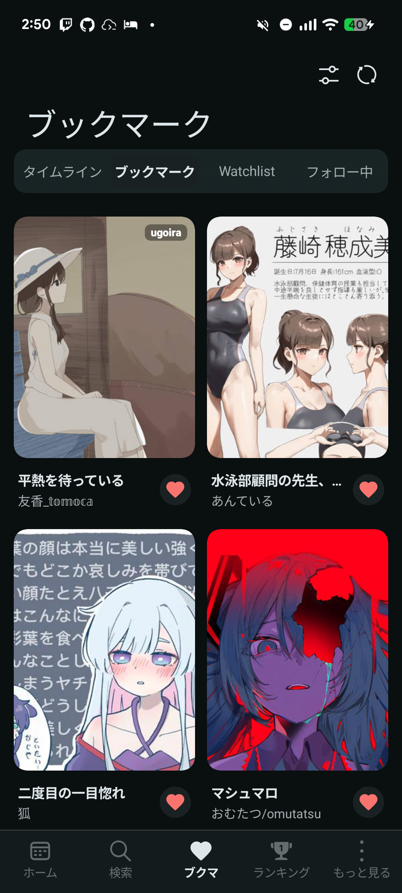
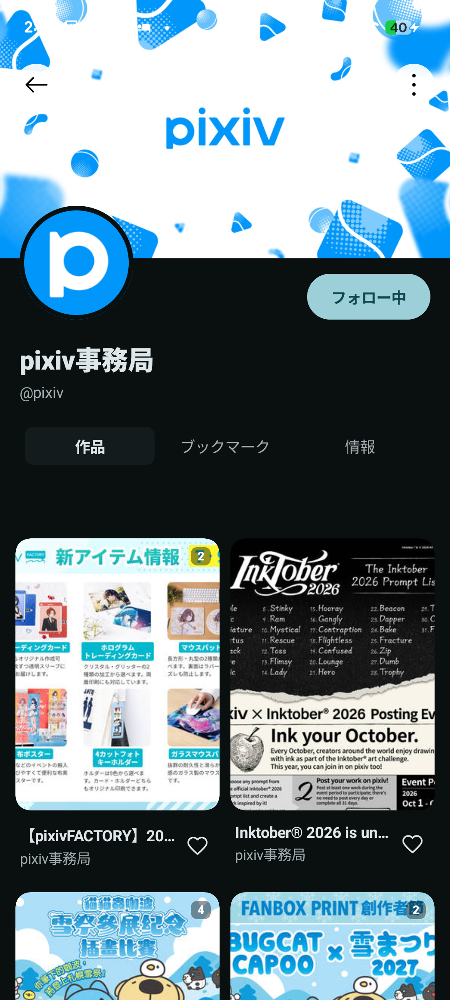
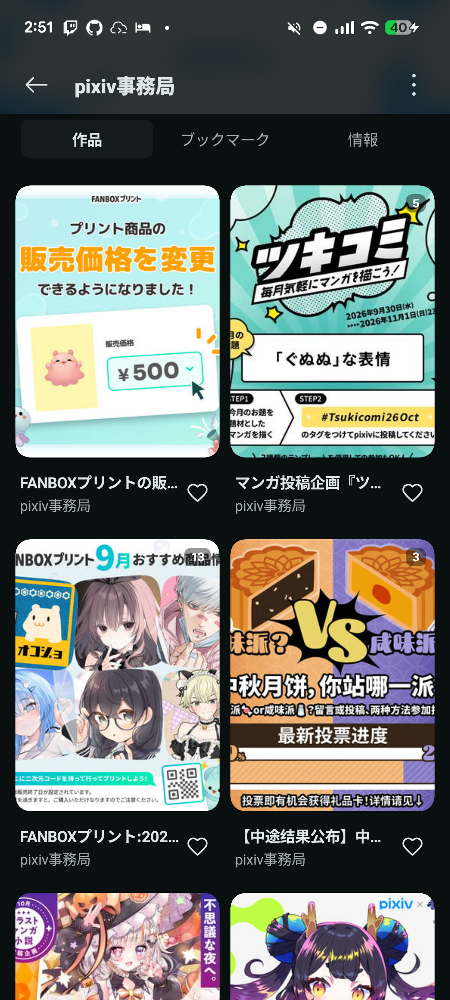

# ブックマークとプロフィール

## ハートでブックマークする

作品のハートはブックマークの追加・解除です。通常のタップでは設定した既定の公開範囲を使います。未登録のイラストでハートを長押しすると、非公開ブックマークとして追加します。タグ選択ダイアログを開く操作ではありません。

登録済みの作品ではハート操作が解除になるため、公開範囲を変更するつもりで押さないようにしてください。通信後に結果が画面へ反映されます。

<figure class="app-screenshot">

<figcaption>ブックマーク画面。塗りつぶされたハートは登録済みの作品です。</figcaption>
</figure>

## フォローとプロフィール

作品の作者名・アイコンからプロフィールを開けます。フォローすると、フォロー中ユーザーの新着を一覧から確認できます。公開・非公開の扱いはフォロー操作の設定に従います。

プロフィールの「作品」「ブックマーク」「情報」を切り替えると、投稿作品、閲覧できるブックマーク、ユーザー情報を確認できます。「情報」タブには作品用の並べ替え・絞り込みボタンを表示しません。

<figure class="app-screenshot">

<figcaption>プロフィール上部。作品・ブックマーク・情報を切り替えられます。</figcaption>
</figure>

<figure class="app-screenshot">

<figcaption>下へスクロールするとヘッダーが縮まり、作品一覧を広く表示します。</figcaption>
</figure>

