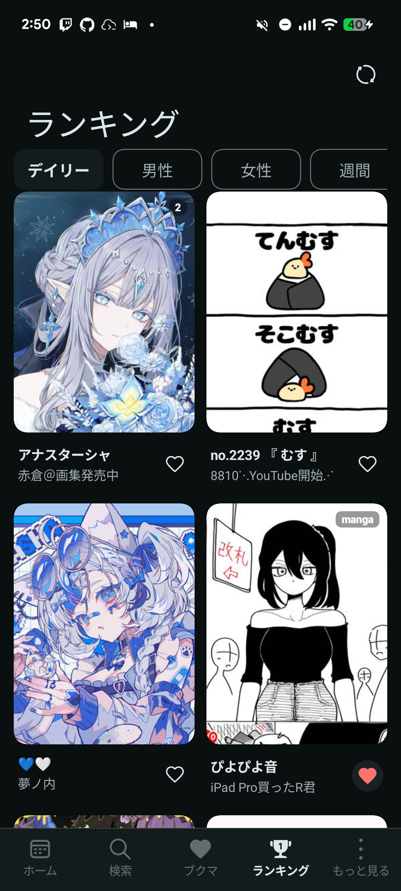
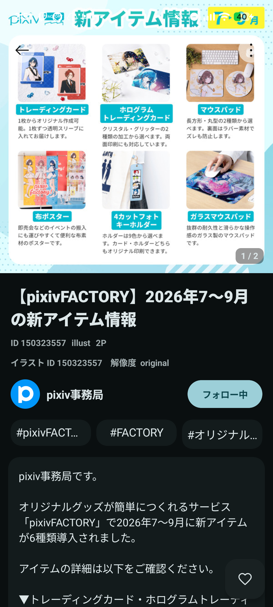
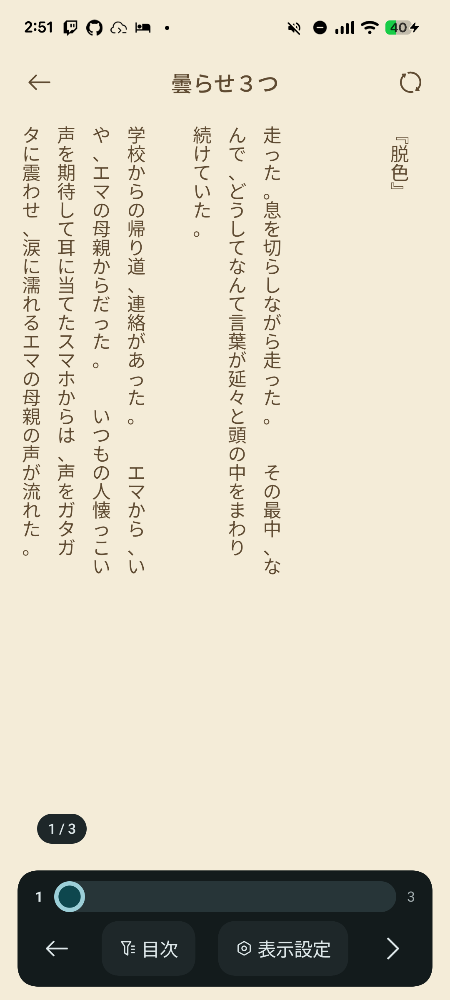

# 作品を見る

## ホームとランキング

ホームでは「フィード」と「フォロー中」を切り替えます。ランキングでは画面上部の項目からデイリー・男女別・週間などの種類を選びます。表示対象は年齢制限・ミュートなどの設定にも従います。

<figure class="app-screenshot">

<figcaption>ランキングの表示例。上部の項目を切り替えて作品を探せます。</figcaption>
</figure>

## イラスト・マンガ

カードをタップすると作品詳細を開きます。詳細には画像、ページ数、タイトル、作者、タグ、説明文などが表示されます。作者を押すとプロフィール、タグを押すとそのタグの検索へ進みます。

<figure class="app-screenshot">

<figcaption>作品詳細の例。複数ページ作品ではページ数も表示されます。</figcaption>
</figure>

画像ビューアではピンチ・ダブルタップによる拡大縮小、複数ページの移動を利用できます。マンガの読み方や画質は表示設定に従います。カードの長押しはQuickPeek、一覧の2本指ピンチはグリッド列数の変更です。

## うごイラ

うごイラ作品はフレーム画像を取得して再生します。保存時にはGIF・MP4への変換処理があります。静止画と異なり、フレーム取得や変換に時間がかかる場合があります。

## 小説リーダー

小説一覧は小説へのボタンから開きます。ホームの小説ボタンを非表示にしている場合は「もっと見る」に小説の入口が表示されます。

横書き・縦書き、文字サイズ・行間・背景などを表示設定から調整できます。目次やページ位置の操作で読みたい場所に移動できます。

<figure class="app-screenshot">

<figcaption>縦書き表示の例。本文下部にはページ位置、目次、表示設定があります。</figcaption>
</figure>

### 読み上げ（TTS）

小説本文を端末のText-to-Speechエンジンで読み上げます。音声、速度、ピッチを変更でき、再生・一時停止などを操作できます。対応する声や言語は端末のTTSエンジンによって異なります。

一時停止からの再開では、エンジンが通知した読み上げ範囲の開始位置を保持します。正確な途中再開には範囲通知に対応したエンジンが必要です。バックグラウンド再生は通知とMediaSessionを使用しますが、OSの強制終了後まで再生継続を保証するものではありません。

## キーボード・マウス

画像・小説では矢印キーやSpaceでページ移動、Fで全画面切り替え、Ctrl+Wで閉じる操作ができます。画像ビューアではCtrl+Sで表示ページを保存し、小説ではJ / Kで段落移動できます。詳しくは[デスクトップ入力](/dev/chromeos)を参照してください。
