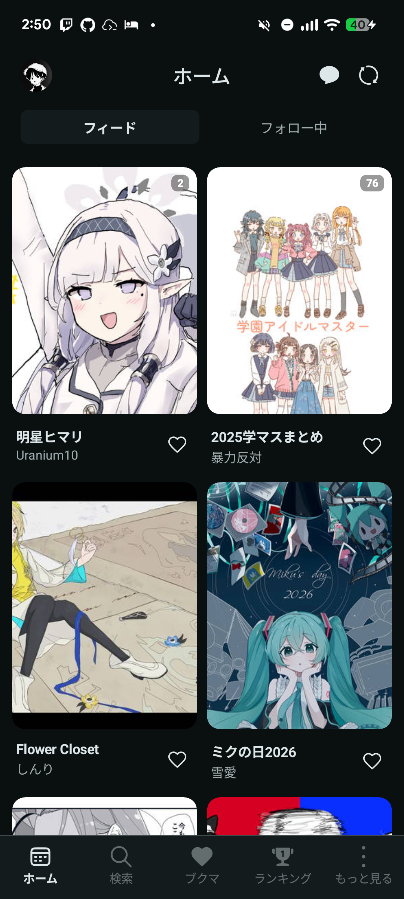

# Palleria ユーザーガイド

Palleriaは、Android向けの非公式Pixivクライアントです。イラスト・マンガ・うごイラ・小説の閲覧、ブックマーク、画像保存などを利用できます。

## 動作環境

- Android **7.0（API 24）以降**。Pixivのオンライン機能にはログインが必要です。
- ARM 64bit、ARM 32bit、x86_64向けAPKと、これらを含むuniversal APKを用意しています。
- タッチ入力に加え、キーボード・マウス操作にも対応します。[ChromeOSでの操作](/dev/chromeos)も参照してください。

## まず使う画面

| タブ | 内容 |
| --- | --- |
| ホーム | フィードとフォロー中ユーザーの新着作品 |
| 検索 | 作品・小説・ユーザー検索、最近見た作品、おすすめタグ |
| ブックマーク | タイムライン、ブックマーク、Watchlist、フォロー中 |
| ランキング | デイリーなどのランキングを切り替えて閲覧 |
| もっと見る | 設定、履歴、ダウンロード、オフラインライブラリなど |

タブの順番・表示・起動タブは設定で変更できます。ショートフィードを有効にした場合は検索タブ位置がショートに置き換わります。スクリーンショットは撮影時のテーマ・表示設定で、作品や順位は固定ではありません。

<figure class="app-screenshot">

<figcaption>ホームのフィード。カードをタップすると作品詳細を開きます。</figcaption>
</figure>

## 使い方から探す

- [インストール](/user/installation)と[ログイン](/user/authentication)
- [作品の閲覧・小説読み上げ](/user/browse)
- [検索](/user/search)と[ブックマーク・プロフィール](/user/bookmarks)
- [保存とオフライン閲覧](/user/downloads)
- [外観設定](/user/personalization)と[アプリロック](/user/security)
- [端末間同期](/user/sync)と[壁紙・ウィジェット](/user/wallpaper-widget)
