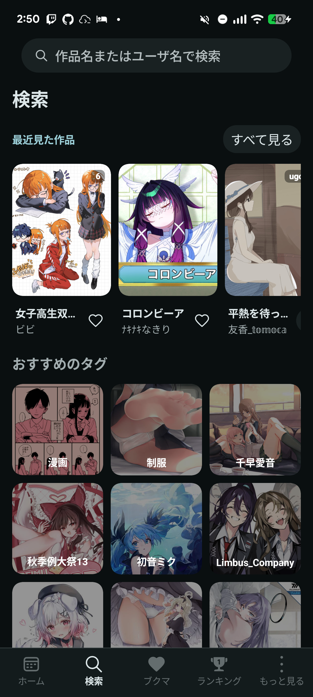

# 検索とお気に入りタグ (ウォッチリスト)

---

## さがす

<figure class="app-screenshot">

<figcaption>検索画面。上部の入力欄やおすすめタグから検索できます。</figcaption>
</figure>

検索画面では、以下の方法で作品を探せます。

- **タグ検索**: 見たいジャンルやキャラクターのタグで検索します。
- **完全一致検索**: そのタグにぴったり合う作品だけを表示します。
- **タイトル・説明文検索**: 作品名や作者の説明文に入っている言葉で探します。
- **ユーザー検索**: 作者名 で絵師さんを探します。

---

## 絞り込み (フィルター)

- **ソート**: 「投稿が新しい順」「投稿が古い順」「人気順」に並び替えできます。
- **ブクマ数フィルター**: 「1000users入り」「5000users入り」など、人気の作品だけに絞り込めます。
- **年齢制限**: ブックマーク数の下にある「すべて」「R-18」「R-18G」から選択できます。作品・小説の検索語に対応するタグを追加し、検索履歴やユーザー検索の語句は変更しません。選択は保存され、フィルターのリセットで「すべて」に戻ります。設定画面で非表示にしている R-18／R-18G 作品は、選択しても表示されません。
- **期間指定**: 「24時間以内」「1週間以内」などの投稿時期で絞り込めます。

---

## ウォッチリスト (お気に入りタグ)

よく検索する好きなタグを**ウォッチリスト**に登録しておくと便利です。

- 検索したタグをお気に入りタグに追加して登録します。
- ブックマーク画面のWatchlistから登録したタグの作品を確認できます。
